# Diagrama de Clases — Entidades de Dominio y Enumeraciones

> Modelo de datos del backend NovaLibros basado en el esquema Prisma (PostgreSQL).
> Cada entidad incluye los métodos CRUD disponibles a través de su Service.

---

```mermaid
classDiagram
    direction TB

    %% ╔══════════════════════════════════════════════╗
    %% ║              ENUMERACIONES                    ║
    %% ╚══════════════════════════════════════════════╝

    class RolUsuario {
        <<Enumeration>>
        root
        administrador
        cliente
        visitante
    }

    class EstadoLibro {
        <<Enumeration>>
        nuevo
        usado
    }

    class EstadoReserva {
        <<Enumeration>>
        activa
        expirada
        cancelada
        convertida
    }

    class MetodoEntrega {
        <<Enumeration>>
        domicilio
        tienda
    }

    class EstadoPedidoVal {
        <<Enumeration>>
        en_preparacion
        enviado
        entregado
    }

    class EstadoDevolucion {
        <<Enumeration>>
        solicitada
        aprobada
        rechazada
    }

    class TipoTarjeta {
        <<Enumeration>>
        credito
        debito
    }

    class TipoMovimiento {
        <<Enumeration>>
        recarga
        compra
        devolucion
        bono
    }

    %% ╔══════════════════════════════════════════════╗
    %% ║         ENTIDADES DE DOMINIO (Prisma)         ║
    %% ╚══════════════════════════════════════════════╝

    class Usuario {
        +UUID id
        +String dni
        +String nombre
        +String apellido
        +Date fechaNacimiento
        +String correo
        +String contrasenaHash
        +String? direccion
        +String? telefono
        +RolUsuario rol
        +Boolean estadoCuenta
        +DateTime fechaRegistro
        +create(dto: CreateUserDto) Promise
        +createAdmin(dto: CreateUserDto) Promise
        -createWithRole(dto: CreateUserDto, rol: string) Promise
        +login(correo: string, contrasena: string) Promise
        +findAll() Promise
        +findOne(id: string) Promise
        +update(id: string, dto: UpdateUserDto) Promise
        +remove(id: string) Promise
    }

    class Autor {
        +Int id
        +String nombre
        +create(dto: CreateAutoreDto) Promise
        +findAll() Promise
        +findOne(id: number) Promise
        +update(id: number, dto: UpdateAutoreDto) Promise
        +remove(id: number) Promise
    }

    class Genero {
        +Int id
        +String nombre
        +create(dto: CreateGeneroDto) Promise
        +findAll() Promise
        +findOne(id: number) Promise
        +update(id: number, dto: UpdateGeneroDto) Promise
        +remove(id: number) Promise
    }

    class Editorial {
        +Int id
        +String nombre
        +create(dto: CreateEditorialeDto) Promise
        +findAll() Promise
        +findOne(id: number) Promise
        +update(id: number, dto: UpdateEditorialeDto) Promise
        +remove(id: number) Promise
    }

    class Tienda {
        +Int id
        +String nombre
        +String direccion
        +Decimal latitud
        +Decimal longitud
        +create(dto: CreateTiendaDto) Promise
        +findAll() Promise
        +findOne(id: number) Promise
        +update(id: number, dto: UpdateTiendaDto) Promise
        +remove(id: number) Promise
    }

    class Libro {
        +UUID id
        +String titulo
        +Int idAutor
        +Int idEditorial
        +Int anoPublicacion
        +Decimal precio
        +String isbn
        +String idioma
        +String? descripcion
        +String? imagenPortada
        +EstadoLibro estado
        +create(dto: CreateLibroDto) Promise
        +findAll() Promise
        +findOne(id: string) Promise
        +update(id: string, dto: UpdateLibroDto) Promise
        +remove(id: string) Promise
    }

    class LibroGenero {
        +UUID idLibro
        +Int idGenero
    }

    class Inventario {
        +Int id
        +UUID idLibro
        +Int idTienda
        +Int cantidadDisponible
        +Int cantidadBloqueada
        +DateTime fechaActualizacion
        +create(dto: CreateInventarioDto) Promise
        +findAll() Promise
        +findOne(id: number) Promise
        +update(id: number, dto: UpdateInventarioDto) Promise
        +remove(id: number) Promise
    }

    class Reserva {
        +UUID id
        +UUID idUsuario
        +DateTime horaCreacion
        +DateTime horaExpiracion
        +EstadoReserva estado
        +create(dto: CreateReservaDto) Promise
        +findAll() Promise
        +findOne(id: string) Promise
        +update(id: string, dto: UpdateReservaDto) Promise
        +remove(id: string) Promise
    }

    class ItemReserva {
        +Int id
        +UUID idReserva
        +UUID idLibro
        +Int cantidad
        +create(dto: CreateItemsReservaDto) Promise
        +findAll() Promise
        +findOne(id: number) Promise
        +update(id: number, dto: UpdateItemsReservaDto) Promise
        +remove(id: number) Promise
    }

    class CarritoCompras {
        +Int id
        +UUID idUsuario
        +DateTime fechaCreacion
        +DateTime fechaActualizacion
        +create(dto: CreateCarritoDto) Promise
        +findAll() Promise
        +findOne(id: number) Promise
        +update(id: number, dto: UpdateCarritoDto) Promise
        +remove(id: number) Promise
    }

    class DetalleCarrito {
        +Int id
        +Int idCarrito
        +UUID idLibro
        +Int cantidad
        +Decimal precioUnitario
        +create(dto: CreateDetallesCarritoDto) Promise
        +findAll() Promise
        +findOne(id: number) Promise
        +update(id: number, dto: UpdateDetallesCarritoDto) Promise
        +remove(id: number) Promise
    }

    class Pedido {
        +UUID id
        +UUID idUsuario
        +String numeroOrden
        +DateTime fechaOrden
        +Decimal montoTotal
        +MetodoEntrega metodoEntrega
        +Int? idTienda
        +String? direccionEntrega
        +create(dto: CreatePedidoDto) Promise
        +findAll() Promise
        +findOne(id: string) Promise
        +update(id: string, dto: UpdatePedidoDto) Promise
        +remove(id: string) Promise
    }

    class ItemPedido {
        +Int id
        +UUID idPedido
        +UUID idLibro
        +Int cantidad
        +Decimal precioUnitario
        +create(dto: CreateItemsPedidoDto) Promise
        +findAll() Promise
        +findOne(id: number) Promise
        +update(id: number, dto: UpdateItemsPedidoDto) Promise
        +remove(id: number) Promise
    }

    class EstadoPedido {
        +Int id
        +UUID idPedido
        +EstadoPedidoVal estado
        +DateTime fechaCambio
        +create(dto: CreateEstadosPedidoDto) Promise
        +findAll() Promise
        +findOne(id: number) Promise
        +update(id: number, dto: UpdateEstadosPedidoDto) Promise
        +remove(id: number) Promise
    }

    class Devolucion {
        +UUID id
        +UUID idPedido
        +UUID idUsuario
        +String razon
        +String? descripcion
        +EstadoDevolucion estado
        +String? codigoQr
        +create(dto: CreateDevolucioneDto) Promise
        +findAll() Promise
        +findOne(id: string) Promise
        +update(id: string, dto: UpdateDevolucioneDto) Promise
        +remove(id: string) Promise
    }

    class FacturaElectronica {
        +UUID id
        +UUID idPedido
        +UUID idUsuario
        +Decimal montoSubtotal
        +Decimal iva
        +Decimal montoTotal
        +create(dto: CreateFacturaDto) Promise
        +findAll() Promise
        +findOne(id: string) Promise
        +update(id: string, dto: UpdateFacturaDto) Promise
        +remove(id: string) Promise
    }

    class Suscripcion {
        +Int id
        +UUID idUsuario
        +Boolean activa
        +create(dto: CreateSuscripcioneDto) Promise
        +findAll() Promise
        +findOne(id: number) Promise
        +update(id: number, dto: UpdateSuscripcioneDto) Promise
        +remove(id: number) Promise
    }

    class Foro {
        +Int id
        +String titulo
        +DateTime fechaCreacion
        +create(dto: CreateForoDto) Promise
        +findAll() Promise
        +findOne(id: number) Promise
        +update(id: number, dto: UpdateForoDto) Promise
        +remove(id: number) Promise
    }

    class Mensaje {
        +UUID id
        +Int idForo
        +UUID idRemitente
        +String contenido
        +DateTime fechaHora
        +create(dto: CreateMensajeDto) Promise
        +findAll() Promise
        +findOne(id: string) Promise
        +update(id: string, dto: UpdateMensajeDto) Promise
        +remove(id: string) Promise
    }

    class MetodoPago {
        +Int id
        +UUID idUsuario
        +TipoTarjeta tipo
        +String numeroEnmascarado
        +String titular
        +create(dto: CreateMetodosPagoDto) Promise
        +findAll() Promise
        +findOne(id: number) Promise
        +update(id: number, dto: UpdateMetodosPagoDto) Promise
        +remove(id: number) Promise
    }

    class SaldoUsuario {
        +Int id
        +UUID idUsuario
        +Decimal saldoDisponible
        +create(dto: CreateSaldosUsuarioDto) Promise
        +findAll() Promise
        +findOne(id: number) Promise
        +update(id: number, dto: UpdateSaldosUsuarioDto) Promise
        +remove(id: number) Promise
    }

    class MovimientoSaldo {
        +Int id
        +UUID idUsuario
        +TipoMovimiento tipoMovimiento
        +Decimal monto
        +UUID? idPedido
        +Int? idMetodoPago
        +create(dto: CreateMovimientosSaldoDto) Promise
        +findAll() Promise
        +findOne(id: number) Promise
        +update(id: number, dto: UpdateMovimientosSaldoDto) Promise
        +remove(id: number) Promise
    }

    class RegistroBusqueda {
        +Int id
        +UUID idUsuario
        +String criterio
        +create(dto: CreateRegistrosBusquedaDto) Promise
        +findAll() Promise
        +findOne(id: number) Promise
        +update(id: number, dto: UpdateRegistrosBusquedaDto) Promise
        +remove(id: number) Promise
    }

    class BonoCumpleanios {
        +Int id
        +UUID idUsuario
        +Decimal porcentajeDescuento
        +Date fechaVigencia
        +create(dto: CreateBonosCumpleanioDto) Promise
        +findAll() Promise
        +findOne(id: number) Promise
        +update(id: number, dto: UpdateBonosCumpleanioDto) Promise
        +remove(id: number) Promise
    }

    class PreferenciaLiteraria {
        +Int id
        +String nombre
        +create(dto: CreatePreferenciasLiterariaDto) Promise
        +findAll() Promise
        +findOne(id: number) Promise
        +update(id: number, dto: UpdatePreferenciasLiterariaDto) Promise
        +remove(id: number) Promise
    }

    class UsuarioPreferencia {
        +Int id
        +UUID idUsuario
        +Int idPreferenciaLiteraria
        +create(dto: CreateUsuariosPreferenciaDto) Promise
        +findAll() Promise
        +findOne(id: number) Promise
        +update(id: number, dto: UpdateUsuariosPreferenciaDto) Promise
        +remove(id: number) Promise
    }

    %% ╔══════════════════════════════════════════════╗
    %% ║     RELACIONES: Entidad ↔ Enum                ║
    %% ╚══════════════════════════════════════════════╝

    Usuario --> RolUsuario : rol
    Libro --> EstadoLibro : estado
    Reserva --> EstadoReserva : estado
    Pedido --> MetodoEntrega : metodoEntrega
    EstadoPedido --> EstadoPedidoVal : estado
    Devolucion --> EstadoDevolucion : estado
    MetodoPago --> TipoTarjeta : tipo
    MovimientoSaldo --> TipoMovimiento : tipoMovimiento

    %% ╔══════════════════════════════════════════════╗
    %% ║     RELACIONES: Catálogo de Libros            ║
    %% ╚══════════════════════════════════════════════╝

    Autor "1" --> "*" Libro : escribe
    Editorial "1" --> "*" Libro : publica
    LibroGenero --> Libro : idLibro
    LibroGenero --> Genero : idGenero
    Libro "1" --> "*" Inventario : stock en
    Tienda "1" --> "*" Inventario : almacena

    %% ╔══════════════════════════════════════════════╗
    %% ║     RELACIONES: Reservas                      ║
    %% ╚══════════════════════════════════════════════╝

    Usuario "1" --> "*" Reserva : realiza
    Reserva "1" --> "*" ItemReserva : contiene
    Libro "1" --> "*" ItemReserva : reservado en

    %% ╔══════════════════════════════════════════════╗
    %% ║     RELACIONES: Carrito de Compras            ║
    %% ╚══════════════════════════════════════════════╝

    Usuario "1" --> "*" CarritoCompras : tiene
    CarritoCompras "1" --> "*" DetalleCarrito : contiene
    Libro "1" --> "*" DetalleCarrito : agregado en

    %% ╔══════════════════════════════════════════════╗
    %% ║     RELACIONES: Pedidos y Facturación         ║
    %% ╚══════════════════════════════════════════════╝

    Usuario "1" --> "*" Pedido : ordena
    Tienda "1" --> "*" Pedido : recoge en
    Pedido "1" --> "*" ItemPedido : contiene
    Libro "1" --> "*" ItemPedido : vendido en
    Pedido "1" --> "*" EstadoPedido : historial
    Pedido "1" --> "*" FacturaElectronica : facturado
    Usuario "1" --> "*" FacturaElectronica : recibe

    %% ╔══════════════════════════════════════════════╗
    %% ║     RELACIONES: Devoluciones                  ║
    %% ╚══════════════════════════════════════════════╝

    Pedido "1" --> "*" Devolucion : genera
    Usuario "1" --> "*" Devolucion : solicita

    %% ╔══════════════════════════════════════════════╗
    %% ║     RELACIONES: Financiero                    ║
    %% ╚══════════════════════════════════════════════╝

    Usuario "1" --> "*" MetodoPago : registra
    Usuario "1" --> "*" SaldoUsuario : posee
    Usuario "1" --> "*" MovimientoSaldo : genera
    MetodoPago "1" --> "*" MovimientoSaldo : origen
    Pedido "1" --> "*" MovimientoSaldo : asociado

    %% ╔══════════════════════════════════════════════╗
    %% ║     RELACIONES: Social y Preferencias         ║
    %% ╚══════════════════════════════════════════════╝

    Usuario "1" --> "*" Suscripcion : suscrito
    Foro "1" --> "*" Mensaje : contiene
    Usuario "1" --> "*" Mensaje : escribe
    Usuario "1" --> "*" RegistroBusqueda : busca
    Usuario "1" --> "*" BonoCumpleanios : recibe
    Usuario "1" --> "*" UsuarioPreferencia : tiene
    PreferenciaLiteraria "1" --> "*" UsuarioPreferencia : asignada a
```

