# Diagrama Entidad-Relación — NovaLibros

## Enums

| Enum | Valores |
|------|---------|
| `RolUsuario` | root, administrador, cliente, visitante |
| `EstadoLibro` | nuevo, usado |
| `EstadoReserva` | activa, expirada, cancelada, convertida |
| `MetodoEntrega` | domicilio, tienda |
| `EstadoPedidoVal` | en_preparacion, enviado, entregado |
| `EstadoDevolucion` | solicitada, aprobada, rechazada |
| `TipoTarjeta` | credito, debito |
| `TipoMovimiento` | recarga, compra, devolucion, bono |

## Diagrama ER

```mermaid
erDiagram

    %% ══════════════════════════════════════
    %% ENTIDADES
    %% ══════════════════════════════════════

    Autor {
        int id PK
        string nombre
    }

    Genero {
        int id PK
        string nombre
    }

    Editorial {
        int id PK
        string nombre
    }

    Tienda {
        int id PK
        string nombre
        string direccion
        decimal latitud
        decimal longitud
    }

    Usuario {
        uuid id PK
        string dni UK
        string nombre
        string apellido
        date fechaNacimiento
        string correo UK
        string contrasenaHash
        string direccion
        string telefono
        RolUsuario rol
        boolean estadoCuenta
        timestamptz fechaRegistro
    }

    Libro {
        uuid id PK
        string titulo
        int idAutor FK
        int idEditorial FK
        int anoPublicacion
        decimal precio
        string isbn
        string idioma
        string descripcion
        string imagenPortada
        EstadoLibro estado
    }

    LibroGenero {
        uuid idLibro PK,FK
        int idGenero PK,FK
    }

    Inventario {
        int id PK
        uuid idLibro FK
        int idTienda FK
        int cantidadDisponible
        int cantidadBloqueada
        timestamptz fechaActualizacion
    }

    Reserva {
        uuid id PK
        uuid idUsuario FK
        timestamptz horaCreacion
        timestamptz horaExpiracion
        EstadoReserva estado
    }

    ItemReserva {
        int id PK
        uuid idReserva FK
        uuid idLibro FK
        int cantidad
    }

    CarritoCompras {
        int id PK
        uuid idUsuario FK
        timestamptz fechaCreacion
        timestamptz fechaActualizacion
    }

    DetalleCarrito {
        int id PK
        int idCarrito FK
        uuid idLibro FK
        int cantidad
        decimal precioUnitario
    }

    Pedido {
        uuid id PK
        uuid idUsuario FK
        string numeroOrden
        timestamptz fechaOrden
        decimal montoTotal
        MetodoEntrega metodoEntrega
        int idTienda FK
        string direccionEntrega
    }

    ItemPedido {
        int id PK
        uuid idPedido FK
        uuid idLibro FK
        int cantidad
        decimal precioUnitario
    }

    EstadoPedido {
        int id PK
        uuid idPedido FK
        EstadoPedidoVal estado
        timestamptz fechaCambio
    }

    Devolucion {
        uuid id PK
        uuid idPedido FK
        uuid idUsuario FK
        string razon
        string descripcion
        EstadoDevolucion estado
        string codigoQr
    }

    FacturaElectronica {
        uuid id PK
        uuid idPedido FK
        uuid idUsuario FK
        decimal montoSubtotal
        decimal iva
        decimal montoTotal
    }

    Suscripcion {
        int id PK
        uuid idUsuario FK
        boolean activa
    }

    Foro {
        int id PK
        string titulo
        timestamptz fechaCreacion
    }

    Mensaje {
        uuid id PK
        int idForo FK
        uuid idRemitente FK
        string contenido
        timestamptz fechaHora
    }

    MetodoPago {
        int id PK
        uuid idUsuario FK
        TipoTarjeta tipo
        string numeroEnmascarado
        string titular
    }

    SaldoUsuario {
        int id PK
        uuid idUsuario FK
        decimal saldoDisponible
    }

    MovimientoSaldo {
        int id PK
        uuid idUsuario FK
        TipoMovimiento tipoMovimiento
        decimal monto
        uuid idPedido FK
        int idMetodoPago FK
    }

    RegistroBusqueda {
        int id PK
        uuid idUsuario FK
        string criterio
    }

    BonoCumpleanios {
        int id PK
        uuid idUsuario FK
        decimal porcentajeDescuento
        date fechaVigencia
    }

    PreferenciaLiteraria {
        int id PK
        string nombre UK
    }

    UsuarioPreferencia {
        int id PK
        uuid idUsuario FK
        int idPreferenciaLiteraria FK
    }

    %% ══════════════════════════════════════
    %% RELACIONES
    %% ══════════════════════════════════════

    %% Libro
    Autor ||--o{ Libro : "escribe"
    Editorial ||--o{ Libro : "publica"

    %% Libro ↔ Género (M:N)
    Libro ||--o{ LibroGenero : "tiene"
    Genero ||--o{ LibroGenero : "clasifica"

    %% Inventario
    Libro ||--o{ Inventario : "almacena"
    Tienda ||--o{ Inventario : "tiene"

    %% Reserva
    Usuario ||--o{ Reserva : "realiza"
    Reserva ||--o{ ItemReserva : "contiene"
    Libro ||--o{ ItemReserva : "reservado en"

    %% Carrito de Compras
    Usuario ||--o{ CarritoCompras : "posee"
    CarritoCompras ||--o{ DetalleCarrito : "contiene"
    Libro ||--o{ DetalleCarrito : "agregado en"

    %% Pedido
    Usuario ||--o{ Pedido : "ordena"
    Tienda ||--o{ Pedido : "recoge en"
    Pedido ||--o{ ItemPedido : "contiene"
    Libro ||--o{ ItemPedido : "vendido en"
    Pedido ||--o{ EstadoPedido : "tiene historial"

    %% Devolución
    Pedido ||--o{ Devolucion : "genera"
    Usuario ||--o{ Devolucion : "solicita"

    %% Factura
    Pedido ||--o{ FacturaElectronica : "facturado en"
    Usuario ||--o{ FacturaElectronica : "recibe"

    %% Suscripción
    Usuario ||--o{ Suscripcion : "se suscribe"

    %% Foro / Mensajes
    Foro ||--o{ Mensaje : "contiene"
    Usuario ||--o{ Mensaje : "escribe"

    %% Métodos de Pago
    Usuario ||--o{ MetodoPago : "registra"

    %% Saldo
    Usuario ||--o{ SaldoUsuario : "tiene"
    Usuario ||--o{ MovimientoSaldo : "genera"
    Pedido ||--o{ MovimientoSaldo : "asociado a"
    MetodoPago ||--o{ MovimientoSaldo : "usa"

    %% Búsqueda
    Usuario ||--o{ RegistroBusqueda : "busca"

    %% Bono
    Usuario ||--o{ BonoCumpleanios : "recibe"

    %% Preferencias Literarias (M:N)
    Usuario ||--o{ UsuarioPreferencia : "elige"
    PreferenciaLiteraria ||--o{ UsuarioPreferencia : "elegida por"
```

