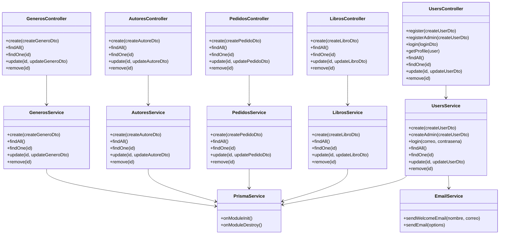
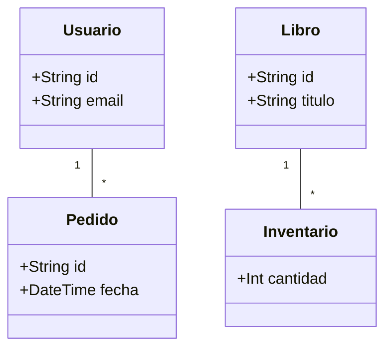

# Diagrama de Clases - Arquitectura de novaLibros

Este documento detalla la estructura de clases del backend, incluyendo controladores, servicios y sus relaciones.

## Arquitectura de Módulos (Controladores y Servicios)

El sistema sigue una arquitectura de capas (Controller -> Service -> Prisma/DB). A continuación se muestran los métodos y atributos principales de cada módulo.

> Nota: Se han simplificado los tipos para mayor claridad. Todos los servicios utilizan PrismaService para acceso a datos.

## Modelo de Datos (Dominio)

